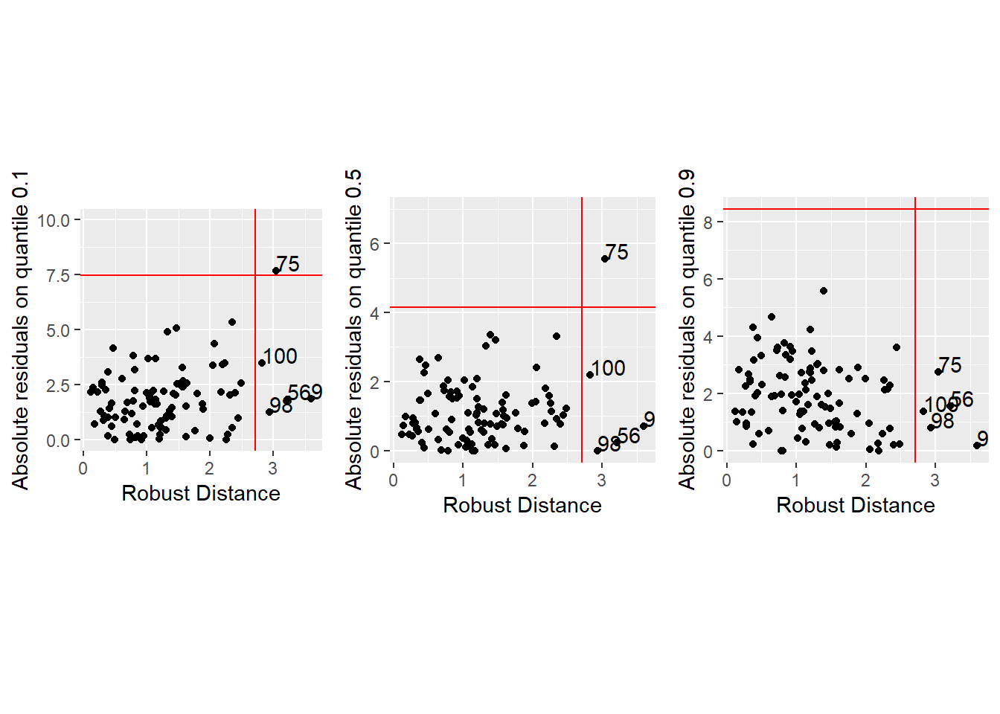
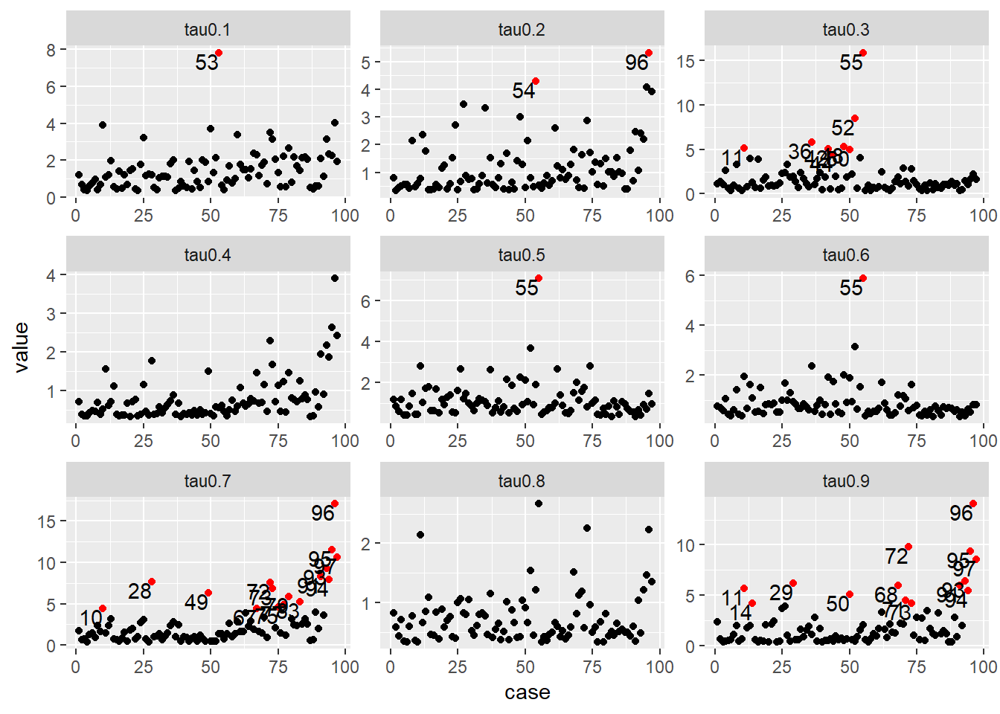
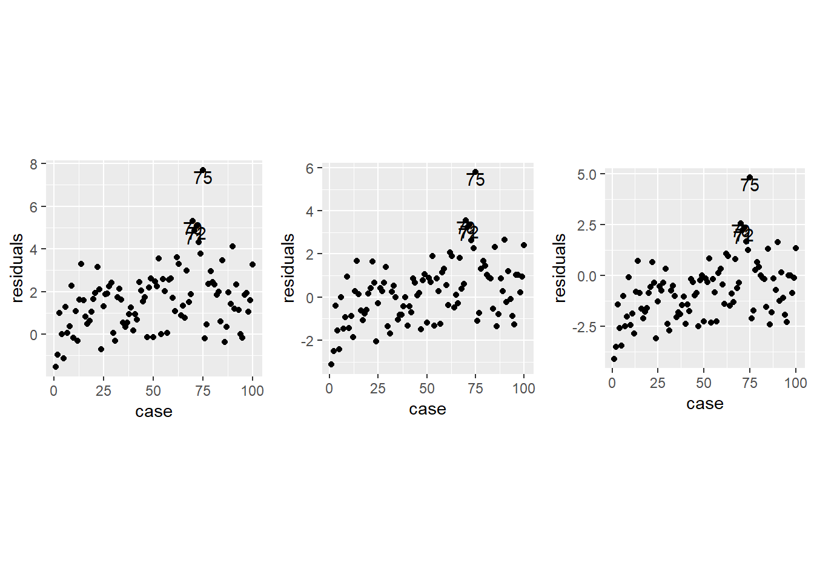

This project improves the functionality for diagnosing outliers in quantile regression in the R package `quokar`. First, the implementation of the diagnosing algorithm is optimized in Baysian quantile regression framework, resulting in a significant speed gain. Second, an elemental sets diagnosing method is added, optimizing the leverage diagnostic in previous package. Third, a regression depth estimator is added, providing new diagnosinig method based on robust regression. This project page gives a summary of the work done during Google Summer of Code 2018.

This project is done under guidance of Dianne Cook and Kris Boudt. 

Installing the most current master branch of `quokar` available on Github can be done as follows


```r
require(devtools)
install_github("wenjingwang/quokar")
```

## Part 1

The first part of this project can be found in [this](https://github.com/wenjingwang/quokar/pull/3) pull request. Here the function `bayesKL` has been rewritten to improve the speed. The previous version of this function calculated the pairwise comparison of Kullback–Leibler divergence for all observations in quantile regression model, which results in the computational complexity of O(2^(n - 1) * n). In this new version of function `bayesKL`, we improve the pairwise comparison algrithom by first traversing all observations then implement comparison which simplifies the computational complexity to O(n).

Furthermore, we revise function `ALDqr_GCD` and `ALDqr_QD` to adapt to the maximum likelihood estimator of quantile regression under asymmetric Laplace distribution (Benites et al, 2016). The calculation of maximum likelihood estimator of quantile regression under asymmetric Laplace distribution is implemented by EM algorithm. These two functions are renamed as `GCDqr` and `LDqr` to diagnose outliers in regression model on each quantile based on the mle estimator or maximum likelihood function. 


In addition, we revise function `bayesKL` and `bayesProb` to adapt to the Bayesian quantile regression estimator under asymmetric Laplace distribution (Santos & Bolfarine, 2016). The Bayesian quantile regression estimator involves MCMC algorithm which add additional input parameter `ndraw` to function `bayesKL_qr` and `bayesProb_qr`. These two functions are restructured to implement outlier diagnosing based on Baysian quantile regression estimator by comparing the mean probability or Kullback–Leibler divergence of the posterior distribution of the latent variable which is affected by each observation under bayesian framework. 

The data examples of the functions mentioned above can be downloaded here.

For now, this part still has to be merged with the master branch, to load the code in order to use the `GCDqr`, `LDqr`, `bayesKL_qr` and `bayesProb_qr`, do:


```r
require("githubinstall")
gh_install_packages("wenjingwang/quokar", ref = "improve_speed")
```

## Part 2

Next, we implement Elemental Sets method for quantile regression leverage diagnostic based on Rangnai & Vuuren (2014). We propose to use multiple-case high leverage diagnositc for quantile regressions using elemental regressions which is based only on the minimum number of observations p to estimate the parameters of the given model.

We calculate the leverage statistics for each observation by using the relationship among quantile regression, elemental regression and OLS. To split the observations into elemental sets, we use the L1 simplex algorithm for estimating the L1-quantile estimator of  quantile regression. Based on the elemental sets and leverage statsitics from OLS regression, we calculate the leverage statistics for QR model.

This Elemental Sets method performs leverage diagnosis for regression models on each quantile. The previous idea of leverage diagnositc implemented in `frame_distance` function in `quokar` is based on robust distance of covariate. Robust distance of covariate is data oriented which is not insufficient for each quantile regression model. Comparing to this, the Elemental Set method is regression model oriented and more targeted for each quantile.

This part of work can be found in [this](https://github.com/wenjingwang/quokar/pull/4) pull request. For now, this part still has to be merged with the master branch, to load the code in order to use the `high_leverage_qr`, do:


```r
require("githubinstall")
gh_install_packages("wenjingwang/quokar", ref = "high_leverage_qr")
```
Here we introduce how to use the newly implemented tools, and show you how they improve the previous method in package `quokar` to diagnose outliers in quantile regression model.

To explore the newly implemented methods, we will use dataset from `DAAG::ais`. This dataset contains 13 body characteristics variables for 202 Australian athletes. There are 100 female athletes and 102 male althletes.

```{r}
library(DAAG)
dim(ais)
ais
```

Here we compare the functionality of `frame_distance` and newly implemented `high_leverage_qr`.

```{r}
library(quokar)
library(quantreg)
library(tidyverse)
library(gridExtra)
ais_female <- filter(ais, Sex == 1) # get female data from the data set
model1 <- rq(BMI ~ LBM + Bfat, data = ais_female, tau = c(0.1, 0.5, 0.9))
## outlier diagnostic
r1 <- frame_distance(model1, tau = c(0.1, 0.5, 0.9))
distance <- r1$Distance
cutoff_v <- r1$`Vertical Cutoff`
cutoff_h <- r1$`Horizental Cutoff` * 0.6 ## default parameters for calculate cutoff values
distance$case <- 1:nrow(ais_female)
distance$residuals <- abs(distance$residuals)
distance1 <- subset(distance, tau_flag == "tau0.1")
distance2 <- subset(distance, tau_flag == "tau0.5")
distance3 <- subset(distance, tau_flag == "tau0.9")
p1 <- ggplot(distance1, aes(x = rd, y = residuals)) +
  geom_point() +
  geom_hline(yintercept = cutoff_h[1], colour = "red") +
  geom_vline(xintercept = cutoff_v, colour = "red") +
  geom_text(data = subset(distance1, residuals > cutoff_h[1]| rd > cutoff_v), 
            aes(x = rd, y = residuals, label = case), hjust = 0, vjust = 0) +
  xlab("Robust Distance") +
  ylab("Absolute residuals on quantile 0.1")+
  ylim(c(0, 10)) +
  theme(aspect.ratio = 1)
p2 <- ggplot(distance2, aes(x = rd, y = residuals)) +
  geom_point() +
  geom_hline(yintercept = cutoff_h[2], colour = "red") +
  geom_vline(xintercept = cutoff_v, colour = "red") +
  geom_text(data = subset(distance2, residuals > 
                            cutoff_h[2]| rd > cutoff_v), 
            aes(label = case), hjust = 0, vjust = 0) +
  xlab("Robust Distance") +
  ylab("Absolute residuals on quantile 0.5")+
  ylim(c(0,7)) +
  theme(aspect.ratio = 1)
p3 <- ggplot(distance3, aes(x = rd, y = residuals)) +
  geom_point() +
  geom_hline(yintercept = cutoff_h[3], colour = "red") +
  geom_vline(xintercept = cutoff_v, colour = "red") +
  geom_text(data = subset(distance3, residuals > 
                            cutoff_h[3]| rd > cutoff_v), 
            aes(label = case), hjust = 0, vjust = 0) +
  xlab("Robust Distance") +
  ylab("Absolute residuals on quantile 0.9")+
  theme(aspect.ratio = 1)
grid.arrange(p1, p2, p3, ncol = 3)
```


The leverages identified are same across different quantile regression models which is only related to the covariates data. 

In the newly implemented function `high_leverage_qr`, we have,

```{r}
library(quokar)
tau <-  seq(0.1, 0.9, by = 0.1)
r2 <- high_leverage_qr(formula = BMI ~ LBM + Bfat, data = ais_female, tau = tau)
obs_leverage <- r2 # high leverage statistics for all observations on each quantile
colnames(obs_leverage) <- paste0("tau", tau, sep = "")
case <- 1:nrow(obs_leverage)
leverage_dat <- as.data.frame(cbind(case = 1:nrow(obs_leverage), obs_leverage))
leverage_dat_long <- gather(leverage_dat, tau, value, -case)
ggplot(leverage_dat_long, aes(x = case, y = value)) +
  geom_point() +
  geom_point(data = subset(leverage_dat_long, 
                           value > median(value) + 2*sd(value)), 
             colour = "red") +
  geom_text(data = subset(leverage_dat_long, 
                          value > median(value) + 2*sd(value)),
            aes(label = case), vjust = 1, hjust = 1) +
  facet_wrap(~ tau, scales = "free")
```


We get the potential high leverage observations for regression model on each quantile. The results show that for regression models on different quantiles we have different potential leverages.

More data example can be found [here](https://github.com/wenjingwang/gsoc-R/blob/master/R/First_phrase_report.R).

## Part 3

Finally, the third stage of this project implements the regression depth estimator. An estimator based on Rousseeuw \& Hubert (1999) and Debruyne et al. (2008). The L1-quantile estimator used in linear quantile regression model is resistant to vertical outliers (observations that are outlying in $y$ given $x$). However, it can be heavily influenced by leverage points (observations outlying in x-space). Slightest amount of contamination can have a disastrous effect on the resulting estimates. 

L1-quantiles take less information in the residuals of the model into consideration. This estimator only depends on the sign of the residuals and not on the exact value of the response variable which may result in the unrobustness. The quantile regression depth estimator provides robust estimation. Based on the robust estimator of quantile regression model, we can easily detect observations outlying from others by comparing the observed value and fitted value. We provide `plot` method for `qrdepth` class object to visualize outliers in quantile regression based on depth estimator which is implemented in function `plot.outlier.qrdepth`.

To illustrate the different performance of L1-quantile estimator and quantile regression depth estimator, we provide the following data example:


More data example can be found [here](https://github.com/wenjingwang/gsoc-R/blob/master/R/Second_phrase_report.R).

This part of work can be found in [this](https://github.com/wenjingwang/quokar/pull/5) pull request. For now, this part still has to be merged with the master branch, to load the code in order to use the `qrdepth`, do:

```r
require("githubinstall")
gh_install_packages("wenjingwang/quokar", ref = "qrdepth")
```
Here we introduce how to use `qrdepth` and visulization methods,

```{r}
library(quokar)
data <- subset(ais, Sex == 1)
formula <- BMI ~ LBM + Bfat
qrdepth1 <- qrdepth(formula, data, tau = 0.1)
qrdepth2 <- qrdepth(formula, data, tau = 0.5)
qrdepth3 <- qrdepth(formula, data, tau = 0.9)
p1 <- plot.outlier.qrdepth(qrdepth1)
p2 <- plot.outlier.qrdepth(qrdepth2)
p3 <- plot.outlier.qrdepth(qrdepth3)
grid.arrange(p1, p2, p3, ncol = 3)
```


## Further work

The aim of this project is to improve the functionality of outlier diagnostic methods within R package `quokar`. This project includes computating speed improvements of the previous functions in `quokar`, also integrates the implementation of new diagnosing methods.

I will continue to update the package when new diagnosing methods for quantile regression are proposed in the literature. 

## References

Santos B, Bolfarine H. On Bayesian quantile regression and outliers[J]. arXiv preprint arXiv:1601.07344, 2016.

Benites L E, Lachos V H, Vilca F E. Case-deletion diagnostics for Quantile regression using the asymmetric Laplace distribution[J]. arXiv preprint arXiv:1509.05099, 2015.

Ranganai E, Van Vuuren J O, De Wet T. Multiple case high leverage diagnosis in regression quantiles[J]. Communications in Statistics-Theory and Methods, 2014, 43(16): 3343-3370.

Debruyne M, Hubert M, Portnoy S, et al. Censored depth quantiles[J]. Computational statistics & data analysis, 2008, 52(3): 1604-1614.

Rousseeuw P J, Hubert M. Regression depth[J]. Journal of the American Statistical Association, 1999, 94(446): 388-402.

## Contact me

wenjingwangr@gmail.com


